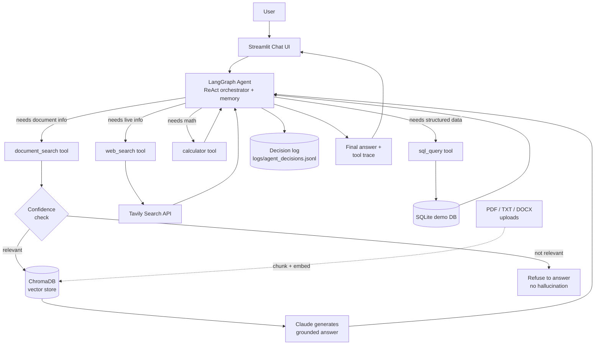

# 🤖 DocuAgent — RAG + Agentic AI Demo

An AI assistant that combines **Retrieval-Augmented Generation (RAG)** with
**Agentic tool-use**: it answers questions grounded in your own documents,
searches the web, runs calculations, and queries a database — deciding on
its own, per question, which of those tools (if any) it actually needs.

> Built as a from-scratch demo of the two most in-demand GenAI patterns in
> one working system, with tested guardrails, a live "show your reasoning"
> UI, Docker deployment, and a CI-ready test suite.

---

## Why this project

Most GenAI demos show *one* capability: either a chatbot that answers from
documents (RAG), or a chatbot that calls a few tools (an agent). Real
production systems usually need both — and need to know *when* to use each.
This project is a compact but complete example of that combination:

- **Knows things** — grounded answers from real documents, not the model's
  memorized training data
- **Does things** — live web search, math, and structured database queries
- **Decides for itself** — a single question like *"What's our refund
  policy, and what's 15% of $200?"* correctly triggers **two** tools in one
  turn, not a hardcoded pipeline
- **Doesn't lie when it doesn't know** — a confidence check refuses to
  answer from documents that don't actually cover the question

## Demo

https://github.com/user-attachments/assets/PLACEHOLDER — *(record a 60–90s
screen capture of a multi-tool query and drop it here, or add a GIF — see
"Recording your own demo" below)*

**Suggested demo script** (this is the moment that sells the project):

1. Open the app, click **"Load sample documents"** in the sidebar
2. Ask: *"What is our refund policy for annual plans?"* → shows a grounded,
   sourced answer via `document_search`
3. Ask: *"What is our refund policy, and what's 15% of $200?"* → expand the
   **🧠 Agent Reasoning** panel to show **both** `document_search` and
   `calculator` firing for one question
4. Ask something off-topic, e.g. *"What's the capital of Mongolia?"* — show
   that it refuses to hallucinate from the documents instead of guessing
5. Ask a follow-up question that relies on conversation memory

### Recording your own demo

```bash
streamlit run frontend/streamlit_app.py
```
Use any screen recorder (macOS: Cmd+Shift+5, Windows: Xbox Game Bar
Win+G, or [OBS Studio](https://obsproject.com/) cross-platform) to capture
60–90 seconds following the script above, export as a GIF or short MP4, and
replace the placeholder link above — GitHub renders both inline in a README.

## Architecture



**The core idea:** the Agent is the "brain." For every message it decides —
using an LLM, not a fixed if/else pipeline — which tool(s) to call, in what
order, before answering. A single question can trigger multiple tools.

## Features

| Capability | Where |
|---|---|
| Document-grounded Q&A (RAG) | `app/rag/` |
| Multi-tool agentic reasoning | `app/agent/orchestrator.py` |
| Live web search | `app/tools/web_search_tool.py` (Tavily API) |
| Safe math evaluation (no `eval()`) | `app/tools/calculator_tool.py` |
| Read-only, injection-safe SQL | `app/tools/sql_tool.py` |
| Hallucination guardrail | `app/rag/rag_chain.py` confidence check |
| Agent decision logging | `app/agent/logger.py` |
| Conversation memory | LangGraph checkpointer, per-thread |
| Live document upload | Streamlit sidebar, `frontend/streamlit_app.py` |
| "Show your reasoning" UI panel | Same file — expands per-message tool trace |
| Automated test suite | `tests/test_queries.py` (pytest) |
| Docker + Compose deployment | `Dockerfile*`, `docker-compose.yml` |

## Tech Stack

Claude (Anthropic API) · LangGraph · LangChain · ChromaDB · FastAPI ·
Streamlit · SQLite · Tavily · Docker · pytest

## Quick Start

```bash
# 1. Create and activate a virtual environment
python3 -m venv venv
source venv/bin/activate      # Windows: venv\Scripts\activate

# 2. Install dependencies (pinned to exactly what this project was tested against)
pip install -r requirements.txt

# 3. Set up environment variables
cp .env.example .env
# edit .env and add ANTHROPIC_API_KEY (required) and TAVILY_API_KEY (optional, for web search)

# 4. Seed the demo database
python3 -m app.db.init_db

# 5. Run the frontend
streamlit run frontend/streamlit_app.py
```

Or with Docker:

```bash
docker compose up --build
# Frontend: http://localhost:8501
# Backend health check: http://localhost:8000/health
```

## Project Structure

```
genai-rag-agent-demo/
├── app/
│   ├── main.py                 # FastAPI entrypoint (health check / optional API)
│   ├── agent/
│   │   ├── orchestrator.py     # LangGraph agent — the core "brain"
│   │   ├── prompts.py          # Tool-selection system prompt
│   │   ├── memory.py           # Conversation thread helpers
│   │   └── logger.py           # Decision logging
│   ├── rag/
│   │   ├── loader.py           # PDF/TXT/DOCX loading
│   │   ├── chunker.py          # Overlapping chunk splitting
│   │   ├── embeddings.py       # Local, zero-download embedder
│   │   ├── vector_store.py     # ChromaDB wrapper
│   │   ├── retriever.py        # Ingestion + retrieval API
│   │   └── rag_chain.py        # Retrieve → confidence check → generate
│   ├── tools/
│   │   ├── rag_tool.py
│   │   ├── web_search_tool.py
│   │   ├── calculator_tool.py
│   │   └── sql_tool.py
│   └── db/
│       └── init_db.py          # Seeds the demo SQLite database
├── frontend/
│   └── streamlit_app.py        # Chat UI, upload widget, reasoning panel
├── data/sample_docs/           # Sample handbook for RAG demo
├── tests/
│   ├── test_queries.py         # Main pytest suite (all categories)
│   ├── test_rag_pipeline.py
│   ├── test_tools.py
│   ├── test_agent.py
│   └── test_guardrails.py
├── Dockerfile                  # Single-container build (e.g. HF Spaces)
├── Dockerfile.backend
├── Dockerfile.frontend
├── docker-compose.yml
├── .env.example
└── requirements.txt
```

## Testing

```bash
pytest tests/test_queries.py -v
```

12 deterministic tests (calculator, SQL, RAG, web search) run with no API
key required. 4 additional tests verify true multi-tool agent behavior and
require `ANTHROPIC_API_KEY` to be set, since that requires a live LLM
making real routing decisions.

## Guardrails

- **No hallucinated document answers** — a lexical-confidence check refuses
  to answer from documents that don't actually cover the question, rather
  than generating a plausible-sounding guess
- **SQL injection resistant** — only single `SELECT` statements are
  permitted; comments, stacked statements, and destructive keywords are
  rejected before ever touching the database; results are row-limited
- **No arbitrary code execution** — the calculator parses expressions via
  Python's `ast` module instead of `eval()`
- **Full decision trail** — every agent call is logged with its tools,
  inputs, outputs, and final answer

## What I learned building this

- **Tool descriptions are the real prompt engineering.** The agent's
  accuracy at picking the right tool depends almost entirely on how clearly
  each tool's docstring/description explains *when* to use it — better
  descriptions mattered more than a more complex orchestration graph.
- **Embeddings quality is a real trade-off, not a footnote.** Using a
  zero-dependency local hashing embedder (to avoid a network dependency in
  restricted environments) meant raw vector distance wasn't reliable enough
  for a hallucination-confidence threshold — I had to fall back to lexical
  overlap as the signal instead. A production system would swap in a real
  embedding model and could rely on distance directly.
- **Guardrails need to be tested like features, not bolted on.** Writing
  explicit tests for "does the SQL tool reject a DROP TABLE" and "does the
  RAG chain refuse an off-topic question" caught real gaps that manual
  testing would have missed.
- **Reproducibility matters more than it seems at first.** A pinned
  `requirements.txt` that doesn't match what you actually tested against is
  a landmine for deployment — I caught a stale ChromaDB version pin during
  the Docker phase that would have broken the build.

## Roadmap / Possible Extensions

- Swap the local hashing embedder for a real model (`sentence-transformers`
  or an API embedding model) for higher-quality semantic retrieval
- Add a React frontend calling the FastAPI backend over HTTP instead of the
  Streamlit UI calling the agent in-process
- Add authentication and per-user document namespaces
- Stream agent responses token-by-token instead of waiting for the full reply
- Add more tools (calendar, email draft, code execution sandbox)

## License

MIT — see `LICENSE`.
